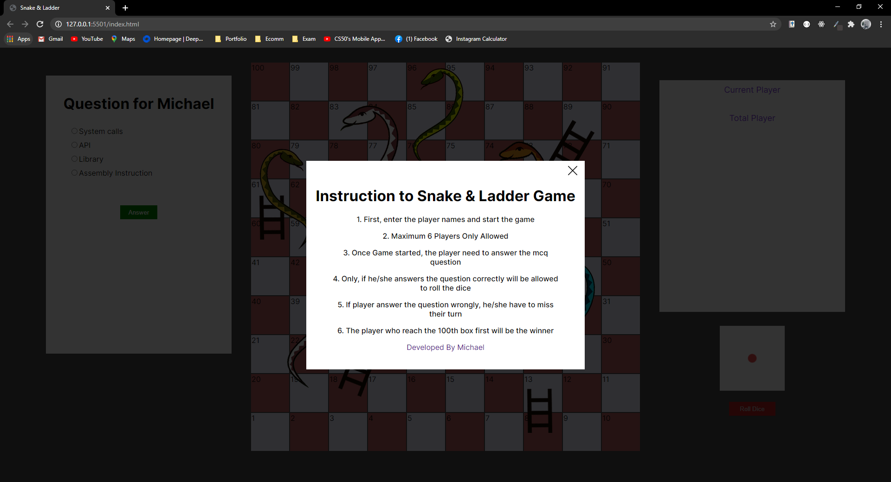
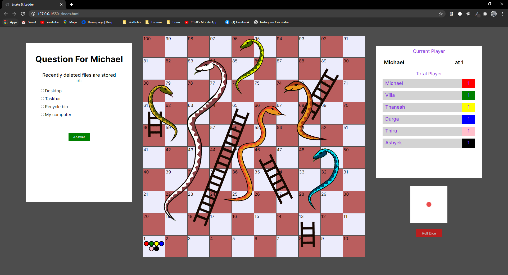
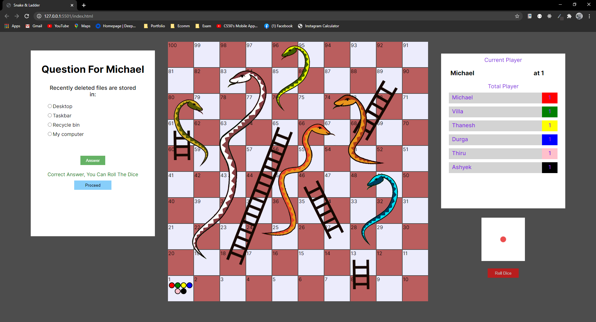
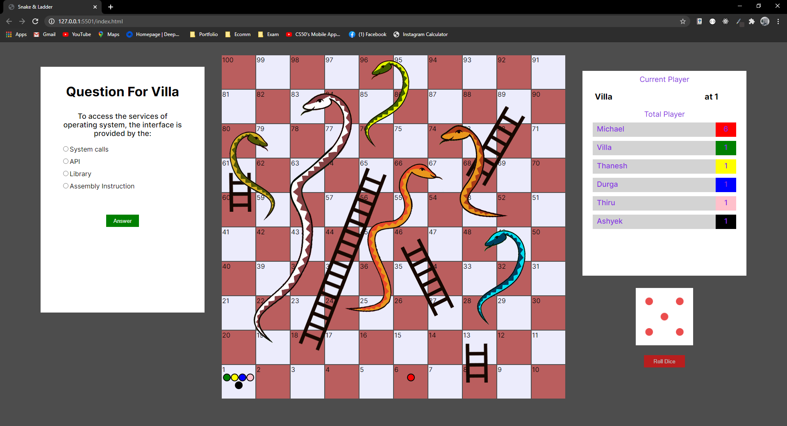
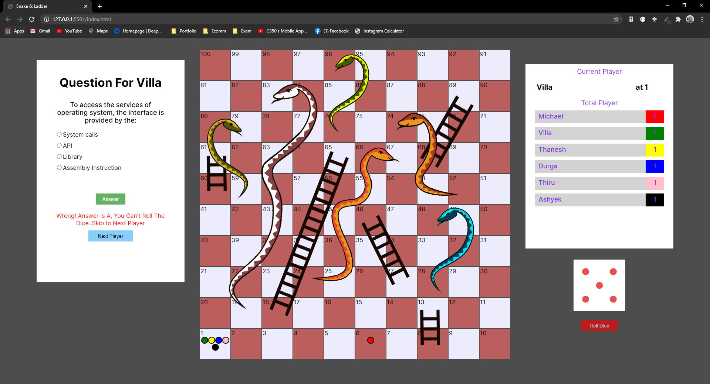
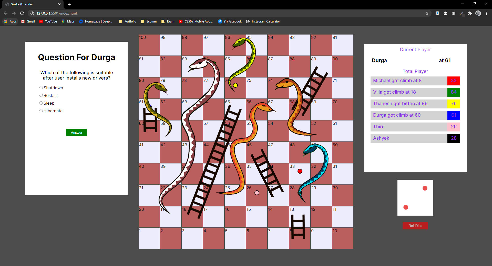
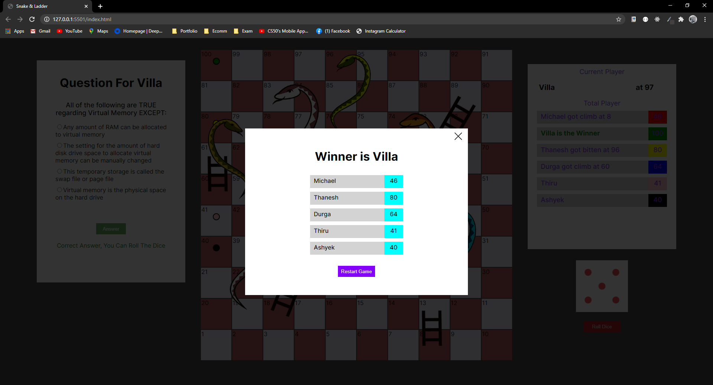

# Snake & Ladder Game - With Quiz (Multiple Player)
Snake &amp; Ladder Board Game with Quiz

You can play this game :
link : https://michaeldepp.github.io/snake-ladder/ 🐍 🎲 

This is a simple online quiz game developed in a board game concept. The board game chosen for this is snake and ladder. This entire project is developed in html, scss, and javascript. The questions, and players can be as much as you want. The tiles also are auto generated, so you can edit the code to generate more tiles but the snake and ladder image need to be adjusted and the traps, and climbs information need to edit before run.

You can edit and customise the question according to the questions you want to implement in the questions.json file.

This is the screenshots of the game.

                                      

                                             

                                             

                                             

